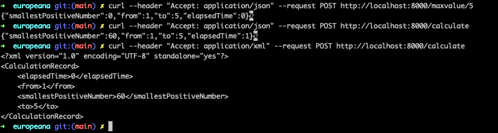
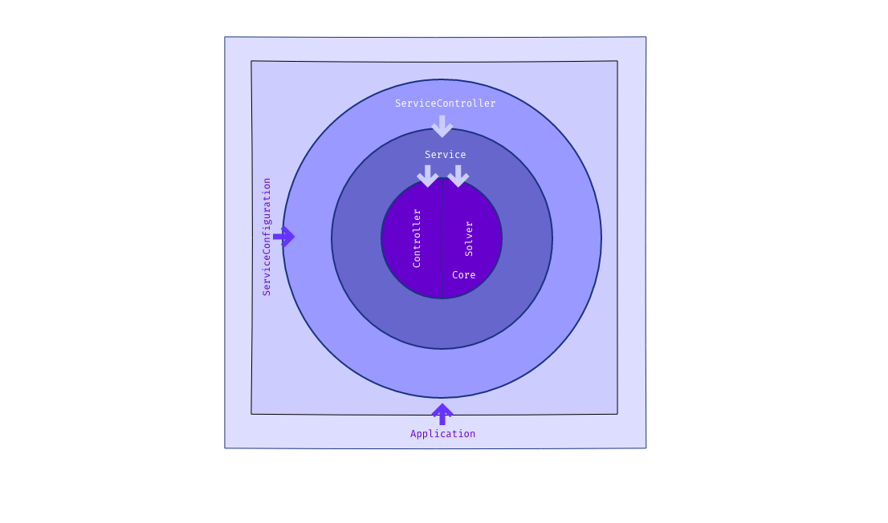

# Table of Contents
- [Table of Contents](#table-of-contents)
- [About the Project](#about-the-project)
- [Description](#description)
- [Built With](#built-with)
- [Getting Started](#getting-started)
- [Prerequisites](#prerequisites)
- [Installation](#installation)
- [Usage](#usage)
    - [To run (docker ready)](#to-run-docker-ready)
- [Roadmap](#roadmap)
- [Contributing](#contributing)
- [License](#license)
- [Contact](#contact)
- [Acknowledgements](#acknowledgements)

# About the Project

# Description
Determines the smallest positive number that can be divided by a sequential range of numbers (from 1 to 25) without remainder.
The following examples show the expected outcome:
```
● 2520 is the smallest number that can be divided by 1 to 10
● 360360 is the smallest number that can be divided by 1 to 15
● and so on...
```

# Built With
* [Java](https://www.java.com)
* [Spring Boot](https://spring.io)

# Getting Started
# Prerequisites
* [Docker Desktop](https://www.docker.com/products/docker-desktop)

# Installation
```
git clone https://github.com/jeortizquan/europeana.git
```

# Usage
### To run (docker ready)
go to the cloned folder of the app, and run the following commands to get the service up and running.
```
docker-compose up -d
```

### Endpoint design specification
### 1. Set the upper boundary value with the command:

#### JSON Format
```
curl --header "Accept: application/json" --request POST http://<host>:<port>/maxvalue{id}
```
Response:
```
HTTP code: 202 Response Body: 
{"smallestPositiveNumber":0,"from":1,"to":{id},"elapsedTime":0} 
```

#### XML Format
```
curl --header "Accept: application/xml" --request POST http://<host>:<port>/maxvalue{id}
```
Response:
```
HTTP code: 202 Response Body:
<?xml version="1.0" encoding="UTF-8" standalone="yes"?>
<CalculationRecord>
    <elapsedTime>0</elapsedTime>
    <from>1</from>
    <smallestPositiveNumber>0</smallestPositiveNumber>
    <to>{id}</to>
</CalculationRecord> 
```

### 2. Start calculation:
#### JSON Format
```
curl --header "Accept: application/json" --request GET http://<host>:<port>/calculate
will calculate from 1 to maxValue, by default maxValue is set to 1. 
```
Response:
```
HTTP code: 200 Response Body: 
{"smallestPositiveNumber":60,"from":1,"to":5,"elapsedTime":0}  
```
#### XML Format
```
curl --header "Accept: application/xml" --request GET http://<host>:<port>/calculate
will calculate from 1 to maxValue, by default maxValue is set to 1. 
```
Response:
```
HTTP code: 200 Response Body: 
<?xml version="1.0" encoding="UTF-8" standalone="yes"?>
<CalculationRecord>
    <elapsedTime>0</elapsedTime>
    <from>1</from>
    <smallestPositiveNumber>60</smallestPositiveNumber>
    <to>5</to>
</CalculationRecord>  
```

### 3. Run API locally (alternative to docker-compose) 
Note: Java and Maven are prerequisites.

Windows
```
mvnw spring-boot:run
```

MacOS/Linux
```
./mvnw spring-boot:run
```

### 4. Swagger
You can use swagger UI to try out the API
```
http://localhost:8000/swagger-ui.html
```

### 5. Metrics & Health Check
You can use the following endpoints
```
http://localhost:8000/actuator/health
http://localhost:8000/actuator/info
http://localhost:8000/actuator/metrics
```
# Architecture

The design behind this system is an approach of clean architecture paradigm.

# Roadmap
- [x] algorithm using loop (limitation until 20) then takes too long.
- [x] algorithm using least common divisor (limitation until 122) then variable long is not supported anymore.
- [ ] implementation with BigInteger to support large numbers.

# Contributing
Any contributions you make are appreciated.

1. Fork the Project
2. Create your Feature Branch (git checkout -b feature/AmazingFeature)
3. Commit your Changes (git commit -m 'Add some AmazingFeature')
4. Push to the Branch (git push origin feature/AmazingFeature)
5. Open a Pull Request

# License
private

# Contact
jeortiz.quan@gmail.com

# Acknowledgements
Blessed are the merciful, for they will be shown mercy.